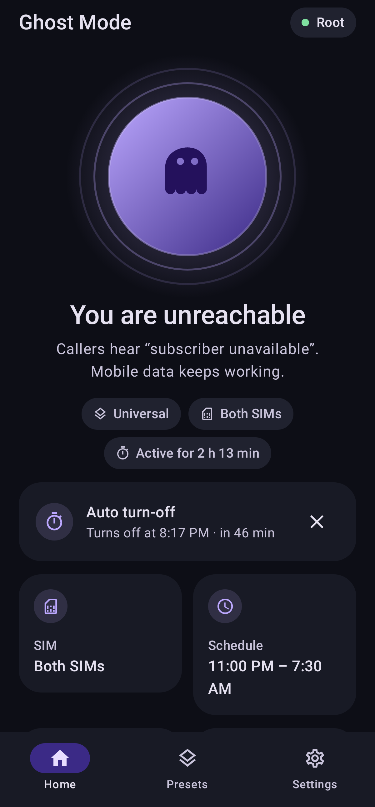
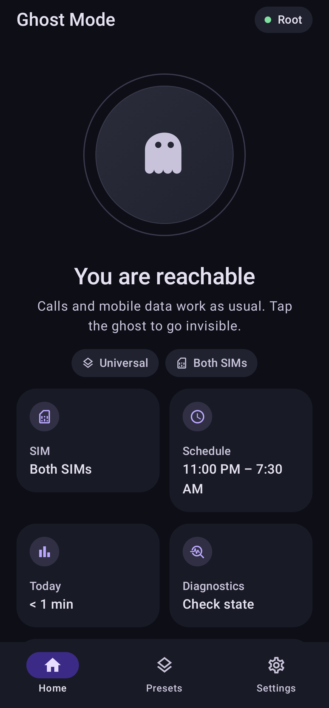
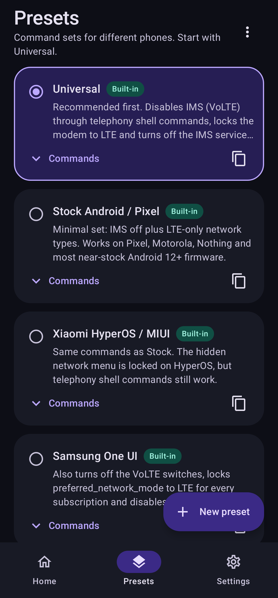
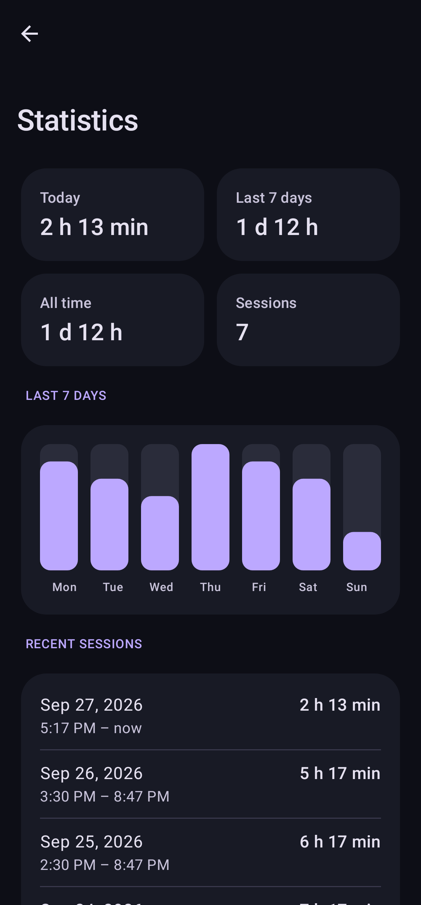

<div align="center">


# Ghost Mode

**Become unreachable for cellular calls while mobile data keeps working.**

[](https://github.com/Foxlape/GhostMode/releases/latest)
[](https://github.com/Foxlape/GhostMode/actions/workflows/ci.yml)
[](#requirements)
[](LICENSE)

[Русская версия](README.ru.md) · [Download](https://github.com/Foxlape/GhostMode/releases/latest) · [Changelog](CHANGELOG.md)

</div>

Ghost Mode makes your phone look switched off to anyone who calls — they hear *"subscriber unavailable"* — while
LTE / 5G data keeps working. Messengers, maps and music continue as usual; only cellular calls stop reaching you.
No airplane mode, no call-blocking rules.

<p align="center">
  
  
  
  
</p>

## Features

- **Works without root** through [Shizuku](https://shizuku.rikka.app) (or Sui and compatible forks); root via KernelSU,
  Magisk or APatch is detected automatically.
- **Exact restore.** Before turning on, the app records the original network types, the values of every setting it
  changes and the IMS services it disables. Turning off puts back exactly that — even if you switched preset or SIM
  in between, or rebooted.
- **Presets** for Pixel / stock Android, Samsung One UI, Xiaomi HyperOS, OnePlus, vivo / iQOO and Android 9–11, plus
  your own command sets with JSON import and export.
- **Dual SIM**: make SIM 1, SIM 2 or both unreachable.
- **Quick Settings tile, home screen widget, launcher shortcuts.**
- **Schedule** (e.g. every night 23:00–07:30) and an **auto turn-off timer**.
- **Reboot-aware**: re-applies itself after a restart when root / Sui is available, otherwise shows a notification.
- **Diagnostics** per SIM, a full **command log** and **statistics**.
- Material You design, dark and light themes, English and Russian.
- No ads, no trackers, no analytics. No network access unless you enable the optional update check.

## Requirements

| | Minimum | Recommended |
|---|---|---|
| Android | 8.0 (API 26) | 12+ (API 31+) — telephony shell commands used by most presets |
| Privileges | Shizuku v11+ **or** root | — |
| Network | LTE coverage | VoLTE-capable carrier |

## Install

- **GitHub Releases** — [latest APK](https://github.com/Foxlape/GhostMode/releases/latest) with `SHA256SUMS.txt`.
- **[Obtainium](https://github.com/ImranR98/Obtainium)** — add `https://github.com/Foxlape/GhostMode` to get updates automatically.
- **F-Droid / IzzyOnDroid** — requested in [#3](https://github.com/Foxlape/GhostMode/issues/3); the repository ships
  fastlane metadata for both.

Official releases are signed with this certificate (also shown in *Settings → About*):

```
SHA-256: FB:2A:E9:C4:80:BB:0F:04:55:65:F7:B5:CA:BF:01:7D:98:18:21:A9:33:F0:78:53:DD:47:12:28:D5:71:B0:50
```

Verify with `apksigner verify --print-certs GhostMode-vX.Y.Z.apk`.

## Quick start

1. **Get access** — one of:
   - *Shizuku*: download the APK from [GitHub](https://github.com/RikkaApps/Shizuku/releases/latest) (the
     *Download Shizuku* button in the app opens the same page), start it via **Wireless debugging** (Android 11+) or
     ADB, then tap **Grant access** in Ghost Mode. The actively maintained fork
     [thedjchi/Shizuku](https://github.com/thedjchi/Shizuku/releases/latest) works too and can start itself after a
     reboot, so Ghost Mode can re-apply the mode without root.
   - *Root*: open Ghost Mode and allow the root request in KernelSU / Magisk / APatch.
2. **Pick a preset** on the *Presets* tab. Start with **Universal**; switch to your vendor's preset if calls still get
   through.
3. **Tap the ghost.** Check from another phone: you should hear "subscriber unavailable", while mobile data keeps
   working (turn Wi-Fi off to be sure).

Not working? Open *Settings → Diagnostics* and *Command log*, then
[open an issue](https://github.com/Foxlape/GhostMode/issues/new/choose) with the copied log.

## How it works

Presets are lists of shell commands executed through Shizuku or `su`. The built-in ones combine:

| Lever | Command | Effect |
|---|---|---|
| IMS off | `cmd phone ims disable -s <slot>` | No VoLTE / VoWiFi registration |
| LTE only | `cmd phone set-allowed-network-types-for-users -s <slot> 01000001000000000000` | No 2G/3G fallback (CSFB) for calls |
| IMS package | `pm disable-user --user 0 <ims package>` | For firmware that ignores the IMS command |
| Settings | `settings put global preferred_network_mode… 11`, `volte_vt_enabled 0` | Samsung, Android 9–11 |

| Preset | For | What it adds |
|---|---|---|
| **Universal** | Any Android 12+ (default) | Disables the IMS service the phone actually uses (detected at runtime) |
| **Stock Android / Pixel** | Pixel, Motorola, Nothing, near-stock | IMS off + LTE only |
| **Xiaomi HyperOS / MIUI** | Xiaomi, Redmi, POCO | Same as stock |
| **Samsung One UI** | Galaxy S / A / Z | VoLTE switches, `preferred_network_mode` for all subscriptions, Samsung IMS packages |
| **OnePlus / OxygenOS** | OnePlus 8–13 | Qualcomm / MediaTek IMS packages |
| **vivo / iQOO** | OriginOS, Funtouch OS | Same as OnePlus |
| **Android 9–11** | Phones without the Android 12 commands | `preferred_network_mode` + airplane-mode toggle |

When you create your own preset, these placeholders are available:

- `-s 0` — rewritten to the selected SIM slot; the command runs once per slot.
- `{{SAVED_MASK}}` — the network-type mask captured before the mode was turned on.
- `{{IMS_PACKAGES}}` — the IMS service packages currently used by the selected SIMs.

Original values of `settings put` keys and packages disabled with `pm disable-user` are restored automatically.

## Limitations

> [!WARNING]
> Do not rely on Ghost Mode when you must be reachable for emergencies.

- **SMS** may be delayed until the mode is off on carriers that deliver SMS over IMS.
- **Call forwarding** "when unreachable" sends callers to voicemail instead.
- Some Samsung models drop VoLTE registration only after a reboot.
- Commands differ between firmware versions. If a preset does not work, send the diagnostics and command log.
- Use the app only on your own device and in line with local regulations.

## Building

Requirements: JDK 17+, Android SDK 35.

```bash
./gradlew assembleDebug            # app/build/outputs/apk/debug/
./gradlew testDebugUnitTest        # unit tests
./gradlew assembleRelease          # signed if keystore.properties exists, unsigned otherwise
./gradlew testDebugUnitTest -Pscreenshots --tests '*ScreenshotTest*'   # regenerate store screenshots
```

Release signing reads `keystore.properties` (`storeFile`, `storePassword`, `keyAlias`, `keyPassword`) or the
`KEYSTORE_FILE`, `KEYSTORE_PASSWORD`, `KEY_ALIAS`, `KEY_PASSWORD` environment variables.

<details>
<summary>Project structure</summary>

```
app/src/main/java/com/ghostmode/app/
├── AppGraph.kt        process-wide objects: state, presets, shell, controller
├── data/              presets, persisted state, applied-state snapshot, statistics
├── domain/            GhostModeController (apply / restore / diagnostics), network masks
├── shell/             root and Shizuku executors, Shizuku user service
├── system/            GhostActions: entry point for every mode change
├── scheduling/        schedule and timer alarms, boot handling
├── service/           status notification and its actions
├── tile/, widget/     Quick Settings tile, home screen widget
└── ui/                Jetpack Compose UI (home, presets, settings, tools)
fastlane/metadata/     store listing texts and screenshots (F-Droid / IzzyOnDroid)
```

</details>

## Contributing

Found commands that work on your phone? Open a
[preset request](https://github.com/Foxlape/GhostMode/issues/new?template=preset_request.yml). For code changes see
[CONTRIBUTING.md](CONTRIBUTING.md). Security issues: see [SECURITY.md](SECURITY.md).

## License

[Apache License 2.0](LICENSE)
