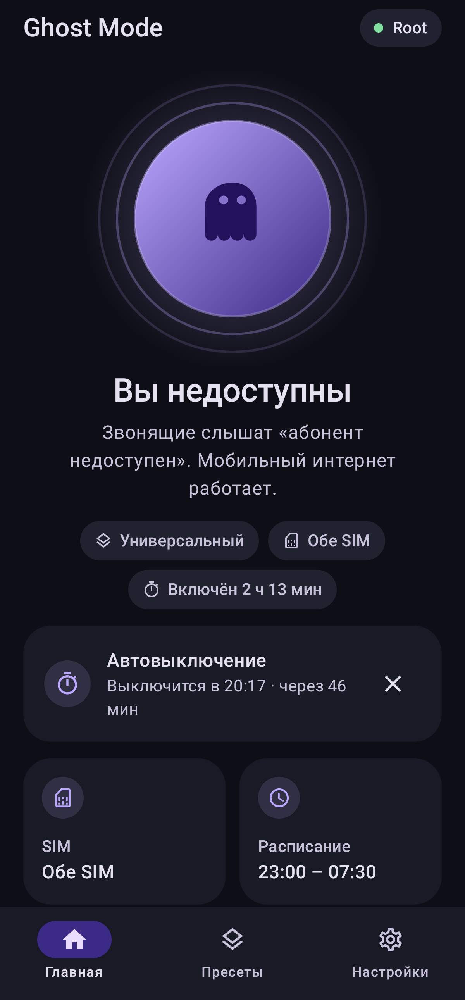
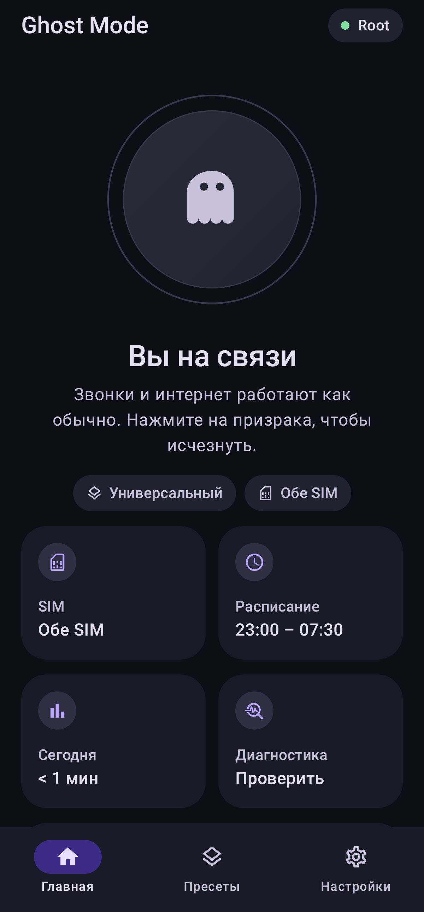
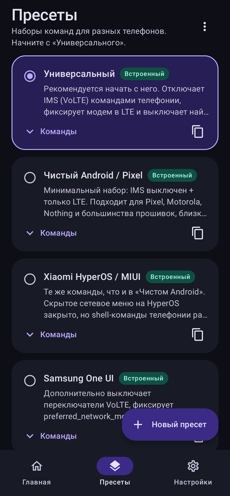
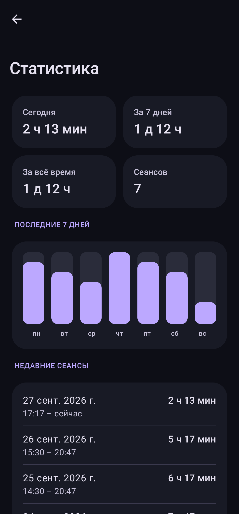

<div align="center">


# Ghost Mode

**Недоступен для звонков — а мобильный интернет работает.**

[](https://github.com/Foxlape/GhostMode/releases/latest)
[](https://github.com/Foxlape/GhostMode/actions/workflows/ci.yml)
[](#требования)
[](LICENSE)

[English version](README.md) · [Скачать](https://github.com/Foxlape/GhostMode/releases/latest) · [История изменений](CHANGELOG.md)

</div>

Ghost Mode делает телефон «выключенным» для всех, кто звонит, — они слышат *«абонент недоступен»*, — а LTE / 5G
интернет продолжает работать. Мессенджеры, карты и музыка работают как обычно, не доходят только сотовые звонки.
Без режима полёта и без правил блокировки вызовов.

<p align="center">
  
  
  
  
</p>

## Возможности

- **Работает без root** через [Shizuku](https://shizuku.rikka.app) (а также Sui и совместимые форки); root через
  KernelSU, Magisk или APatch определяется автоматически.
- **Точное восстановление.** Перед включением приложение запоминает исходные типы сетей, значения всех изменяемых
  настроек и отключаемые IMS-сервисы. Выключение возвращает ровно это — даже если вы сменили пресет или SIM либо
  перезагрузили телефон.
- **Пресеты** для Pixel / чистого Android, Samsung One UI, Xiaomi HyperOS, OnePlus, vivo / iQOO и Android 9–11, плюс
  свои наборы команд с импортом и экспортом в JSON.
- **Две SIM**: недоступной можно сделать SIM 1, SIM 2 или обе.
- **Плитка в шторке, виджет на рабочий стол, ярлыки.**
- **Расписание** (например, каждую ночь 23:00–07:30) и **таймер автовыключения**.
- **Учитывает перезагрузку**: применяет режим заново, если есть root / Sui, иначе присылает уведомление.
- **Диагностика** по каждой SIM, полный **журнал команд** и **статистика**.
- Дизайн Material You, тёмная и светлая темы, русский и английский языки.
- Без рекламы, трекеров и аналитики. В сеть выходит, только если вы включили проверку обновлений.

## Требования

| | Минимум | Рекомендуется |
|---|---|---|
| Android | 8.0 (API 26) | 12+ (API 31+) — shell-команды телефонии, на которых работает большинство пресетов |
| Права | Shizuku v11+ **или** root | — |
| Сеть | Покрытие LTE | Оператор с VoLTE |

## Установка

- **GitHub Releases** — [последний APK](https://github.com/Foxlape/GhostMode/releases/latest) и `SHA256SUMS.txt`.
- **[Obtainium](https://github.com/ImranR98/Obtainium)** — добавьте `https://github.com/Foxlape/GhostMode`, чтобы получать обновления автоматически.
- **F-Droid / IzzyOnDroid** — запрошено в [#3](https://github.com/Foxlape/GhostMode/issues/3); метаданные fastlane для
  обоих каталогов уже в репозитории.

Официальные сборки подписаны этим сертификатом (он же в *Настройки → О приложении*):

```
SHA-256: FB:2A:E9:C4:80:BB:0F:04:55:65:F7:B5:CA:BF:01:7D:98:18:21:A9:33:F0:78:53:DD:47:12:28:D5:71:B0:50
```

Проверка: `apksigner verify --print-certs GhostMode-vX.Y.Z.apk`.

## Быстрый старт

1. **Дайте доступ** — один из вариантов:
   - *Shizuku*: скачайте APK с [GitHub](https://github.com/RikkaApps/Shizuku/releases/latest) (кнопка
     *Скачать Shizuku* в приложении открывает эту же страницу), запустите через **беспроводную отладку** (Android 11+)
     или ADB, затем нажмите **Дать доступ** в Ghost Mode. Подходит и поддерживаемый форк
     [thedjchi/Shizuku](https://github.com/thedjchi/Shizuku/releases/latest): он умеет запускаться сам после
     перезагрузки, и Ghost Mode сможет применить режим заново без root.
   - *Root*: откройте Ghost Mode и разрешите запрос в KernelSU / Magisk / APatch.
2. **Выберите пресет** на вкладке *Пресеты*. Начните с **Универсального**; если звонки всё равно проходят —
   попробуйте пресет вашего производителя.
3. **Нажмите на призрака.** Позвоните себе с другого телефона: должно звучать «абонент недоступен», а мобильный
   интернет — работать (для проверки выключите Wi-Fi).

Не работает? Откройте *Настройки → Диагностика* и *Журнал команд*, затем
[создайте issue](https://github.com/Foxlape/GhostMode/issues/new/choose) со скопированным журналом.

## Как это работает

Пресет — это список shell-команд, которые выполняются через Shizuku или `su`. Встроенные пресеты комбинируют:

| Рычаг | Команда | Эффект |
|---|---|---|
| IMS выкл. | `cmd phone ims disable -s <слот>` | Нет регистрации VoLTE / VoWiFi |
| Только LTE | `cmd phone set-allowed-network-types-for-users -s <слот> 01000001000000000000` | Звонку некуда «откатиться» в 2G/3G (CSFB) |
| IMS-пакет | `pm disable-user --user 0 <пакет IMS>` | Для прошивок, игнорирующих команду IMS |
| Настройки | `settings put global preferred_network_mode… 11`, `volte_vt_enabled 0` | Samsung, Android 9–11 |

| Пресет | Для кого | Что добавляет |
|---|---|---|
| **Универсальный** | Любой Android 12+ (по умолчанию) | Отключает IMS-сервис, который реально использует телефон (определяется на лету) |
| **Чистый Android / Pixel** | Pixel, Motorola, Nothing, близкие к стоку | IMS выкл. + только LTE |
| **Xiaomi HyperOS / MIUI** | Xiaomi, Redmi, POCO | Как у чистого Android |
| **Samsung One UI** | Galaxy S / A / Z | Переключатели VoLTE, `preferred_network_mode` для всех подписок, IMS-пакеты Samsung |
| **OnePlus / OxygenOS** | OnePlus 8–13 | IMS-пакеты Qualcomm / MediaTek |
| **vivo / iQOO** | OriginOS, Funtouch OS | Как у OnePlus |
| **Android 9–11** | Телефоны без команд Android 12 | `preferred_network_mode` + переключение режима полёта |

В своих пресетах доступны подстановки:

- `-s 0` — заменяется на выбранный слот SIM, команда выполняется для каждого слота.
- `{{SAVED_MASK}}` — маска типов сетей, сохранённая до включения режима.
- `{{IMS_PACKAGES}}` — IMS-пакеты, которые сейчас используют выбранные SIM.

Исходные значения ключей `settings put` и пакеты, отключённые через `pm disable-user`, восстанавливаются автоматически.

## Ограничения

> [!WARNING]
> Не полагайтесь на Ghost Mode, если вы должны быть на связи в экстренных ситуациях.

- **SMS** могут задерживаться до выключения режима у операторов, доставляющих SMS через IMS.
- **Переадресация** «если недоступен» отправит звонящих на автоответчик.
- Некоторые модели Samsung снимают регистрацию VoLTE только после перезагрузки.
- Команды различаются между прошивками. Если пресет не работает — пришлите диагностику и журнал команд.
- Используйте приложение только на своём устройстве и в рамках местного законодательства.

## Сборка

Нужны JDK 17+ и Android SDK 35.

```bash
./gradlew assembleDebug            # app/build/outputs/apk/debug/
./gradlew testDebugUnitTest        # юнит-тесты
./gradlew assembleRelease          # подпись из keystore.properties, иначе без подписи
./gradlew testDebugUnitTest -Pscreenshots --tests '*ScreenshotTest*'   # перегенерировать скриншоты
```

Подпись релиза читается из `keystore.properties` (`storeFile`, `storePassword`, `keyAlias`, `keyPassword`) или из
переменных окружения `KEYSTORE_FILE`, `KEYSTORE_PASSWORD`, `KEY_ALIAS`, `KEY_PASSWORD`.

## Участие

Нашли команды, которые работают на вашем телефоне? Создайте
[запрос пресета](https://github.com/Foxlape/GhostMode/issues/new?template=preset_request.yml). Про изменения кода —
[CONTRIBUTING.md](CONTRIBUTING.md). Уязвимости — [SECURITY.md](SECURITY.md).

## Лицензия

[Apache License 2.0](LICENSE)
